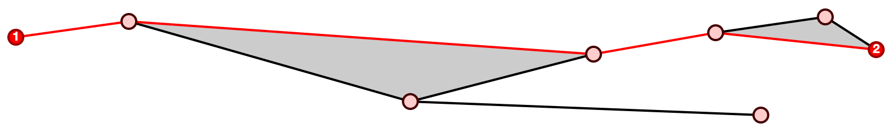

# Constellation.js

A geometry toolkit for controlling 2D sprite motion.



Constellation manages 2D point grids and pathfinding. The library is designed to control sprite motion within a 2D environment. Constellation expands upon the motion control system used in the [What Makes You Tick?](https://www.youtube.com/watch?v=qxngufqrZBE "What Makes You Tick?") adventure game series. Features include:

- Point and cell grid management.
- Point pathfinding with [A-star](http://en.wikipedia.org/wiki/A*_search_algorithm "A-star").
- Cell hit tests with [ray casting](http://en.wikipedia.org/wiki/Point_in_polygon "Ray casting").
- Snapping points to line segments.
- Optimized nearest-point searching.

See the [grid builder](http://gmac.github.io/constellation-js "constellation-js") demo.

## Creating Animations

While Constellation is not an animation library itself, it's designed to work with animation tools. Use Constellation to manage and search grid geometry, then feed its point arrays into your preferred animation library.

# API Documentation

## Constellation.Point

```js
import { Point } from 'constellation';
const pt = new Point(100, 100);
```

**point = new Point(x, y)**

Builds a Point primitive with the following properties:

- `x`: horizontal coordinate of the point.
- `y`: vertical coordinate of the point.

**Point.distance(a, b)**

Calculates the distance between two provided `Point` objects.

## Constellation.Rect

```js
import { Rect } from 'constellation';
const rect = new Rect(10, 10, 100, 100);
```

**rect = new Rect(x, y, width, height)**

Builds a Rect primitive with the following properties:

- `x`: horizontal coordinate of the rectangle origin.
- `y`: vertical coordinate of the rectangle origin.
- `width`: rectangle width.
- `height`: rectangle height.

**rect.hitTest(point)**

Returns `true` if the point falls within the rectangle bounds.

## Constellation.Grid

```js
import { Grid } from 'constellation';
const grid = new Grid(data);
```

**grid = new Grid(data?)**

Builds a new `Grid` instance. A `Grid` object manages a collection of `Node` and `Cell` geometry objects. Accepts an optional grid data structure to build the grid with; this data structure is generated using `grid.toConfig()`.

**grid.toConfig()**

Prints the grid as a plain data structure that may be serialized as JSON. This grid data may be passed to the `Grid` constructor to reconstitue the grid.

**grid.addNode(x, y, data?)**

Adds a new `Node` object with specified X and Y coordinates, and an optional data object. Returns the new `Node` object. An additional data object may be provided; if the data object contains an `id` property, that id will be assigned as the node id.

**grid.getNode(id)**

Gets a node by id reference. Returns a `Node` object, or `null` for missing ids.

**grid.hasNodes([id, ...])**

Tests if all of the specified node ids exist in the grid.

**grid.nodeCount**

Specifies the number of nodes in the grid.

**grid.joinNodes([id1, id2, ...])**

Joins an array of two or more node ids with connections. Returns `true` if changes are made.

**grid.splitNodes([id1, id2, ...])**

Breaks the connections among an array of two or more node ids. Returns `true` if changes are made.

**grid.detachNodes([id, ...])**

Splits an array of node ids from all of their respective connections. Returns `true` if changes are made.

**grid.removeNodes([id, ...])**

Detaches an array of node ids, then removes them each from the grid. Any dependent grid cells are also removed. Returns `true` if changes are made.

**grid.addCell([nodeId, ...], data?)**

Creates a new `Cell` from three or more node ids. Returns the new `Cell` object, or null if no cell was created. An additional data object may be provided; if the data object contains an `id` property, that id will be assigned as the cell id.

**grid.getCell(id)**

Gets a cell by id reference. Returns a `Cell` object, or `null` for missing ids.

**grid.nodesForCell(id)**

Gets an array of `Node` objects defining the point ring of the given cell id.

**grid.cellCount**

Specifies the number of cells in the grid.

**grid.removeCells([id, ...])**

Removes an array of cell ids from the grid. All nodes assocated with the removed cells remain unchanged. Returns `true` if changes are made.

**grid.findPath({ options })**

```ts
grid.findPath({
  start: string,
  goal: string,
  costForSegment?: (a: Node, b: Node) => number,
  costEstimateToGoal?: (a: Node, b: Node) => number,
  bestCandidatePath?: (a: Path, b: Path) => Path,
});
```

Takes `start` and `goal` node ids, then finds the shortest path between them. Routing favors the shortest path based on coordinate geometry by default. You may customize path routing using the optional weight and estimate functions:

- `costForSegment`: used to calculate the weight (or cost) of each new grid segment added to a path. Receives two `Node` objects as arguments: the previous search node, and the current search node. Returns a numeric weight for each path segment. The pathfinder returns a path that accrues the lowest total weight; `Point.distance` is the default measure.

- `costEstimateToGoal`: provides a best-case scenario estimate for each node's cost to reach the goal. Receives two `Node` objects as arguments: the current search node, and the goal node. Returns a numeric estimated cost-to-goal. The pathfinder prioritizes paths that estimate the lowest total weight; `Point.distance` is the default measure.

- `bestCandidatePath`: once a path to goal is reached, subsequent paths discovered with _equal_ cost will use this tiebreaker to select which path to return. Favors the first discovered path by default.

**grid.snapPointToGrid(point)**

Snaps the provided `Point` to the nearest position among all joined line segments within the grid. The snapped point will be plotted along the nearest available line segment. Returns line segment _AB_ (if available) with the point _P_ plotted along it:

- `a`: grid node _A_ of line segment.
- `b`: grid node _B_ of line segment.
- `p`: the snapped `Point` object.

**grid.nearestNodeToNode(id)**

Finds and returns the closest other grid `Node` to the specified node id.

**grid.nearestNodeToPoint(point)**

Finds and returns the closest grid `Node` to the specified point.

**grid.cellsContainingPoint(point)**

Tests a `Point` object for intersections with all `Polygon` objects in the grid, then returns an array of polygon ids that encompass the point.

**grid.nodesInCell(id)**

Returns an array of grid `Node` objects that compose the shape of the given cell id, or those that fall within its bounds.

**grid.nodesInRect(rect)**

Returns an array of grid `Node` objects that fall within the bounds of the given rectangle.

## Constellation.Node

```js
import { Grid } from 'constellation';
const grid = new Grid();
const node = grid.addNode(100, 100, { myMetadata: 23 });
```

**Node (constructor)**

Use `grid.addNode();` to create and manage nodes. Nodes are just `Point` objects with additional attributes, therefore they may be used directly with any methods that recieve `Point` arguments. Grid nodes have the following properties:

- `id`: unique identifier for the node.
- `x`: horizontal coordinate of the node.
- `y`: vertical coordinate of the node.
- `to`: table of connections to other nodes.
- `data?`: a freeform data object with meta attributes for the node.

## Constellation.Cell

```js
import { Grid } from 'constellation';
const grid = new Grid();
const a = grid.addNode(0, 0);
const b = grid.addNode(100, 100);
const c = grid.addNode(150, 75);
const cell = grid.addCell([a.id, b.id, c.id], { myMetadata: 77 });
```

**Cell (constructor)**

Use `grid.addCell();` to create and manage cells. Grid cells have the following properties:

- `id`: unique identifier for the cell.
- `rels`: an array of node ids defining the point ring.
- `data?`: a freeform data object with meta attributes for the cell.

## Constellation.Path

```js
import { Grid } from 'constellation';
const grid = new Grid();
const a = grid.addNode(0, 0);
const b = grid.addNode(50, 50);
const c = grid.addNode(100, 100);
grid.joinNodes([a.id, b.id]);
grid.joinNodes([b.id, c.id]);
const path = grid.findPath({ start: a.id, goal: c.id });
```

Use `grid.findPath();` to create paths. Grid paths have the following properties:

- `nodes`: an array of grid `Node` objects followed by this path.
- `weight`: a numeric weight of the completed path. Uses coordinate geometry distances by default.
- `estimate`: a numeric estimate of the path's cost to completion. Should match weight in completed paths.

## Utilities

```js
import { intersect } from 'constellation';
const x = intersect(new Point(0, 0), new Point(100, 100), new Point(100, 0), new Point(0, 100));
```

**ccw(pointA, pointB, pointC, exclusive?)**

Tests for counter-clockwise winding among three `Point` objects. Returns true if the three points trend in a counter-clockwise arc. Useful for testing line intersections. Passing `true` for the optional `exclusive` param will pass balanced arcs.

**intersect(pointA, pointB, pointC, pointD)**

Tests for intersection between line segments AB and CD. Returns true if the line segments intersect.

**degreesToRadians(degrees)**

Converts [degrees](http://en.wikipedia.org/wiki/Degree_%28angle%29 "Degrees") to [radians](http://en.wikipedia.org/wiki/Radian "Radians").

**radiansToDegrees(radians)**

Converts [radians](http://en.wikipedia.org/wiki/Radian "Radians") to [degrees](http://en.wikipedia.org/wiki/Degree_%28angle%29 "Degrees").

**angleRadians(pointA, pointB)**

Calculates the angle (in radians) between line segment AB and the [positive X-origin axis](http://en.wikipedia.org/wiki/Origin_%28mathematics%29 "Origin axis"). Accepts two `Point` objects and returns the angle in [radians](http://en.wikipedia.org/wiki/Radian "Radians").

**angleDegrees(pointA, pointB)**

Calculates the angle (in degrees) between line segment AB and the [positive X-origin axis](http://en.wikipedia.org/wiki/Origin_%28mathematics%29 "Origin axis"). Accepts two `Point` objects and returns the angle in [degrees](http://en.wikipedia.org/wiki/Degree_%28angle%29 "Degrees").

**angleSector(radians, sectors?, offsetRadians?)**

Gets the [circular sector](http://en.wikipedia.org/wiki/Circular_sector "Circular Sector") index that an angle falls into. You may specify how many sectors to divide the circle into, and then plot an angle among those breaks. This is useful for applying orientation view states to a sprite while moving it around a grid; for example: given a sprite with 4 walk cycles for different orientations (left, front, right, back), use this method to select one of the four views based on the sprite's next angle of motion.

Requires an angle to be provided in radians. You may optionally specify the number of sectors to divide the circle into, the default is 8. Also accepts an optional offset (in radians) used to shift sector divisions off the [positive X-origin axis](http://en.wikipedia.org/wiki/Origin_%28mathematics%29 "Origin axis"). By default, offset is configured as one-half of the sector size, which centers the X-origin axis within the first sector. Returns an index between `0` and `N-1`, where N is the number of sectors.

**boundingRectForPoints([point, ...])**

Receives an array of `Point` objects and returns a `Rect` comprising their bounding box.

**hitTestPointRing(pointP, [point, ...])**

Receives a target point P and an array of points defining a ring. Returns true if P falls within the ring of points. Hit test is performed using [ray casting](http://en.wikipedia.org/wiki/Point_in_polygon "ray casting").

**snapPointToLineSegment(pointP, pointA, pointB)**

Receives target point P, and snaps it to the nearest point along line segment AB.

**nearestPointToPoint(pointP, [point, ...])**

Receives target point P and an array of points to search. Returns the nearest point to P within the array of points, using a basic [nearest neighbor](http://en.wikipedia.org/wiki/Closest_pair_of_points_problem "Nearest neighbor") search.

# Data Graphs

While Constellation is designed to manage 2D coordinate geometry, it also provides support for managing node-based data graphs that can be searched using a-star. For example, let's set up a simple social graph using Constellation's node data API:

```js
import { Grid } from 'constellation';

// Create a social graph with "mom", "sister", "brother", and a "friend":
const grid = new Grid();
grid.addNode(0, 0, { id:'mom', age:50 });
grid.addNode(0, 0, { id:'sister', age:16 });
grid.addNode(0, 0, { id:'brother', age:14 });
grid.addNode(0, 0, { id:'friend', age:14 });

// Create two social rings:
grid.joinNodes('mom', 'sister', 'brother');
grid.joinNodes('mom', 'brother', 'friend');
```

The above defines a graph of data without real coordinates. This graph can be intelligently searched using the *costForSegment* and *costEstimateToGoal* pathfinder functions; for example, the following finds a path with the lowest age:

```js
var path = grid.findPath({
	start: 'sister',
	goal: 'friend',
	costForSegment: (last, current) => last.data.age + current.data.age,
	costEstimateToGoal: (current, goal) => goal.data.age,
});
// result array: ["sister" > "brother" > "friend"]
```
